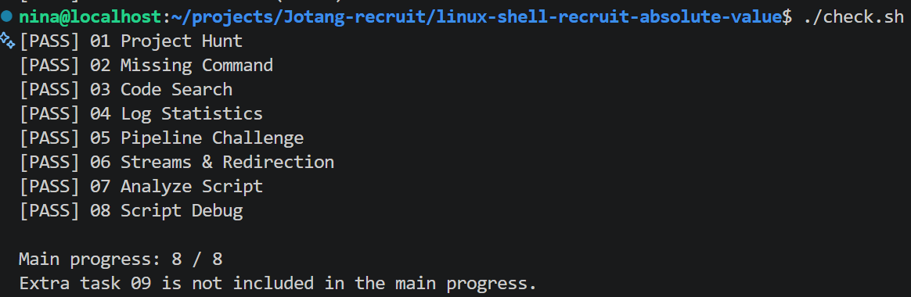
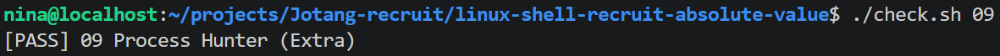

# Linux & Shell 学习笔记

# 完成进度：Task 01-09 全部完成 截图






## #0 获取题目仓库

### 1. 思考1
>注意：不要直接用git clone，否则无法直接提交你的仓库链接。

【分析】
我没有题目仓库 `Gwen1023/linux-shell-recruit` 的写入权限。如果直接 `clone` 它，本地的远程地址默认指向这个原仓库。也就是说，最终推送文件没法弄到自己的仓库里。

### 2. 思考2
>思考为什么需要执行`chmod +x check.sh tools/check-project scripts/start-workers.sh scripts/worker.sh`

【分析】
`chmod` = change mode，用于修改文件的访问权限，`+x` = execute 执行，用于添加执行权限。添加权限后，就可以让检查工具等程序正常运行了:）

### 3. 总结1
***常见参数小汇总**：
    `x` = execute 执行，可以`cd`进入目录 or 访问子路径，可运行（对于文件）；
    `r` = read 读取，可见文件名（`ls`可见目录下文件名称），可查看文件内容（对于文件）；
    `w` = write 写入，能修改文件列表（在目录中可以`touch``rm``mv`），能修改文件内容（对于文件）

---
## #1 Project Hunt

### 1. 前置知识
  - `pwd` = print working directory, 输出当前工作目录（CWD）的**绝对路径**。

  - `ls` = list, 列出指定目录下的内容（含文件名、权限位、大小、修改时间等元数据）。

  - `cd` = change directory, 切换当前工作目录（CWD），即“走进”或“退回”某个路径。

  - `.` = dot, **指向当前目录**~~自身的硬链接~~（即“我此刻站在哪里”）。

  - `..` = dot-dot, **指向当前目录的父目录**~~的硬链接~~（即“我的上一层在哪里”）。

  - 绝对路径, 从根目录（/）起始的完整路径，在任何位置执行都能唯一定位文件。

  - 相对路径, 不从根目录（/）起始，而是从当前工作目录（CWD）出发进行解析的路径，书写时无需`/`。
    
  - `find`, 递归遍历（**所有层级所有子结构**）目录树，按文件名、类型（`-type f`）等元数据（metadata）条件查找文件，但不读取文件内部内容。

  - `grep` = global regular expression print, 逐行读取文件==内部内容==，使用正则引擎匹配模式字符串（如 PROJECT_ID），并输出==匹配==行或文件名。

  - `cat` = concatenate 连接, 读取文件内容并通过标准输出（stdout）直接打印到屏幕（“倾倒”文件内容）。

  - 隐藏文件 = 文件名以点（.）开头的文件或文件夹，不是内核强制锁定的特殊文件，而是用户空间的显示约定（`ls` 默认忽略，`ls -a` （加上all参数）可正常显示并操作）。


---
### 3. ***常见参数汇总（按所属命令分类版👍）**

#### #0 关于`ls`

- `-l` = long，长格式，显示文件的权限、所有者、大小、修改时间等
- `-a` = all, 全部，包括隐藏文件。
- `-h` = human-readable, 把文件大小从字节数变成带单位的简写（比如 1.0M）。
- `-R` = recursive 递归列出, 不仅列出当前文件夹，还列出里面所有子文件夹。
- `-S` = sort by Size, 按文件大小排序。

#### #1 关于`find`（不读文本具体内容）
纯纯找文件用，不识别文字具体内容！

- `-type`按照文件类型筛选,`f` = file, 普通文件
- `-name`根据文件名搜索，支持通配符 *（代表任意字符）。
>`find workspace/ -name "*.log"`找出workplace下所有带.log后缀的文件
- `-size`找出大于（+）或小于（-）某个尺寸的文件。单位可以是 c（字节）、k（KB）、M（MB）。
>`find logs/ -type f -size +10M` 找出所有体积超过 10MB 的日志。
- `-mtime`= modification time, 修改时间，后面跟 - 表示“几天以内”，+ 表示“几天之前”。
>`find scripts/ -type f -mtime -1`找出昨天修改的文件。

#### #2 关于`grep`（识别内容）

>`grep -r "PROJECT_ID" workspace/`
//`""`内是要识别的内容

- `-R` = recursive 递归列出, 不仅列出当前文件夹，还列出里面所有子文件夹。
- `-l` = list, 正常 grep 会把匹配到的那一整行文字都打印出来，但如果加上 -l，grep 就只告诉你哪些文件里有，并且每个文件只报一次。
- `-i` = ignore case（忽略大小写）搜索时不再区分大小写。TODO、Todo、todo 都会被算作命中。
- `-v` = invert match（反向匹配/排除）找出**不包含**某个关键词的行。
- `-n` = line number（显示行号）在输出结果前，标出该行在源文件里是第几行。
- `-c` = count（计数）不显示具体内容，只输出命中的总行数。

---
### 4. ***常见文件类型表格整理**

#### `ls -l` 输出的第一个字符（大概目前只记前两个即可？）
| 缩写字符 | 代表含义 | 通俗解释 |
| --- | --- | --- |
| `-` | 普通文件（Regular file） | 文本、图片、压缩包、可执行程序等。绝大部分文件都是这个。 |
| `d` | 目录（Directory） | 文件夹（如你熟悉的 `.ssh/` 目录）。 |
| `l` | 符号链接（Symbolic Link） | 软链接（快捷方式），指向另一个文件。 |
| `b` | 块设备（Block device） | 存储硬件，如硬盘 `/dev/sda`。 |
| `c` | 字符设备（Character device） | 键盘、鼠标、串口等流式设备。 |
| `s` | 套接字（Socket） | 进程间通信用的接口（常见于 `/var/run`）。 |
| `p` | 管道（Pipe / FIFO） | 用于进程间数据传输的命名管道。 |

#### `find -type` 的选项

| 参数缩写 | 代表含义 | 实操例子 |
| --- | --- | --- |
| `f` | 普通文件 | `find ~/ -type f`（找出家目录下所有普通文件） |
| `d` | 目录 | `find ~/ -type d -name ".ssh"`（找出名为 `.ssh` 的文件夹） |
| `l` | 符号链接 | `find / -type l`（找出所有软链接） |
---

### 5. 看不懂 but 觉得应当知道存在所以贴在这的拓展内容（`*`个数表示看不懂程度）：

    - ***硬链接
    在 Linux 中，文件名和文件数据是分开存储的：

    1. inode（索引节点）：记录文件的物理属性（大小、权限、修改时间、在磁盘上的具体存储位置）。每个 inode 都有一个唯一的编号（inode number）。

    2. 目录项（文件名）：只是一个“指针”或“标签”，指向对应的 inode。

    当你创建一个硬链接时，本质上是在某个目录下新建了一个目录项（文件名），让它指向同一个 inode 编号。

    - **软链接
    软链接通俗地讲，就是 Windows 里的“快捷方式”，或者说是一张写着“某地某物”详细地址的纸条。

    它本身是一个独立的特殊文件，但里面不存储实际数据，只存储了另一个文件或文件夹的路径。当你访问这个软链接时，系统会自动根据里面的“地址”跳转到目标文件。

---

## #2 Missing Command

### 1. 必备知识 

- chmod = change mode（修改模式）修改文件的权限标志，即调整谁能读取、修改或执行该文件。

- 执行权限 = execute bit（运行开关）文件权限位中标为 x 的标记，用于内核识别程序是否可运行。

- ./ = dot slash（从当前目录出发）表示“从当前目录开始”，在命令前加上它，强制告诉 Shell 这是一个路径，从而绕过 PATH 环境变量的查找机制。

示例：`./tools/recruit-info` 
因为 `recruit-info` 不在系统地址簿（PATH）里，必须用 `./` 书写，`Shell` 才会去当前目录下的 tools 文件夹里找它。

- `PATH` （*大概类似于找系统程序的地址簿？*）系统维护的环境变量，存储按冒号 : 分隔的目录列表，用于 Shell 在用户输入不含斜杠的命令名时，依次搜索对应程序的位置。

示例：`echo $PATH`查看当前 Shell 的完整搜索路径列表，确认 tools 目录是否被成功加入。

- `export` 导出变量，将变量标记为环境变量，使其可被当前 Shell 启动的所有子进程（比如 ./check.sh）继承。

示例：`export PATH=$PATH:$(pwd)/tools`把 `tools` 目录的绝对路径追加到了系统地址簿（PATH）的末尾，让当前终端和它启动的判题程序都能找到 `recruit-info`。

- `command -v` = command verbose（查询命令位置）模拟命令查找过程并输出第一个匹配项的位置。

示例：`command -v recruit-info`
验证 PATH 是否配置成功，如果返回 `.../tools/recruit-info`，说明成功。

- `which`（查找程序路径）独立的程序文件（外部命令），仅在 PATH 环境变量中定位可执行文件的绝对路径，不识别别名和 Shell 内置命令。

示例：`which ls`输出`/usr/bin/ls`，查到`ls`来源。

---

## #3 Code Search & #4 Log Statistics

### 1. 可能需要了解的知识点解释
1. `grep`
= Global Regular Expression Print（全局正则表达式打印）
功能：在文件中搜索匹配指定模式的行，并输出匹配结果。
含义：逐行读取文本，~~使用正则表达式引擎匹配模式，（`grep` 中负责解读所给关键词规则）~~默认输出匹配的整行内容。（看不懂 but 感觉理论上应该知道）

`grep` [选项] 模式 [文件...]
// `grep "ERROR" logs/server.log`

2. `wc`
= Word Count（单词计数）
行数（`-l`）、单词数（`-w`）、字节数（`-c`, character）
字符数（`-m`, multi-byte character）、最长行长度

*注意：字符 vs 字节 = 给人看的（无固定大小，逻辑概念） vs 编码给机器看的（物理概念）*


`wc -l output/04_error_users.txt`
// 统计 `output/04_error_users.txt` 文件中有多少行，即有多少个不同的报错用户名。

3. `sort` 排序
将输入的行按字典序或数值顺序排序。默认按 ASCII 字典序升序排列
- `-n` 按数值排序，`-r` 反向排序。

`sort -nr output.txt`
// 将 `output.txt` 中的内容按数值大小降序排列，常用于把出现次数最多的项排到最前面。

4. **`uniq` 唯一**
去除相邻的重复行，或统计重复次数。***必须与 `sort` 配合使用***，否则只能去除相邻重复行，用`sort`则可以全文件解决👍
- `-c` 在行前显示出现次数。

`sort output.txt | uniq -c`
// 先对 output.txt 排序，再去除相邻重复行，并在每行前面显示该行出现的次数。

5. `cut`
按列或字段切分文本行，提取指定部分。
- `-d` 指定分隔符，`-f` 指定要提取的字段编号。

**用法：`cut` `-d`'分隔符' `-f`字段号 [文件...]**
`cut -d' ' -f4 logs/server.log`
\\以空格为分隔符，提取 `logs/server.log` 每行的第 4 个字段（如 `user=alice`），用于进一步分析用户信息。

6.  *关于`|`的纯内存传递：
数据从左边到右边，只装入临时内存缓冲区（执行完自动回收），不写入任何硬盘文件，不经过任何临时文件夹。
大概是类似暗管的东西，总之不会在终端上看见就是了。

7. `head`
显示文件或输入流的开头部分，默认前 10 行。
- `-n` 指定显示的行数。
- `head [选项] [文件...]`

// `head -1 output.txt`
取出排序后的第一行，即出现次数最多的 IP。


---


## #5 Pipeline Challenge

### 1. 可能需要了解的知识点解释（deepseek 整理）

1. `stdin`
= Standard Input（标准输入）
- 功能：程序读取输入数据的默认通道。
- 含义：文件描述符为 `0`，默认来源是键盘。程序运行时，如果没有指定其他输入源，就会从这里读取数据。
- 专业常见用法：`read 变量名`、`cat`（不带文件名时从 stdin 读取）
- 书写示例规范：`cat` 然后手动输入文字，按 `Ctrl+D` 结束
- 操作意图：让程序接收用户或上游命令传入的数据。

2. `stdout`
= Standard Output（标准输出）
- 功能：程序输出**正常结果**的默认通道。
- 含义：文件描述符为 `1`，默认输出到终端屏幕。程序执行成功后的正常结果通常走这里。
- 专业常见用法：`echo "hello"`、`ls`、`grep "ERROR" server.log`
- 书写示例规范：`echo "hello" > output.txt`
- 操作意图：把程序的正常结果保存到文件，或通过管道传给下一个命令。

3. `stderr`
= Standard Error（标准错误）
- 功能：程序输出错误信息的默认通道。
- 含义：文件描述符为 `2`，默认输出到终端屏幕。它与 `stdout` 分开，专门用于报错、警告和调试信息。
- 专业常见用法：`command 2> error.log`
- 书写示例规范：`ls /fake/path 2> error.txt`
- 操作意图：把错误信息单独保存到文件，避免与正常结果混在一起。


4. **`redirect`**（一种机制）
- 功能：改变 `stdin`、`stdout`、`stderr` 的默认流向。
- 含义：通过特殊符号把原本去屏幕或键盘的数据流，改道到文件或其他位置。
- 常见重定向符号：
 - `>`：重定向标准输出（stdout，fd 1），==覆盖==写入。
  - `>>`：重定向标准输出，==追加==（在文件最末尾）写入。
  - `<`：重定向标准输入（stdin，fd 0），从文件读取。
  - `2>`：重定向标准错误（stderr，fd 2），覆盖写入。
  - `&>`：同时重定向 stdout 和 stderr 到同一个文件。
  - `2>&1`：把 stderr 重定向到 stdout 当前指向的地方。（没太看懂，详情见后文#6 补充知识）
- 书写示例规范：`./check.sh 06 > output/06_stdout.txt 2> output/06_stderr.txt`
- 操作意图：把正常输出和错误输出分别保存，便于调试和验收。

5. `pipeline`
- 英文注释辅助理解：Pipeline（管道）
- 功能：将左侧命令的 `stdout` 直接连接到右侧命令的 `stdin`。
- 含义：使用符号 `|`，Shell 创建匿名内核缓冲区，数据纯内存传递，不产生中间文件。
- 专业常见用法：`command1 | command2 | command3`
- 书写示例规范：`grep "ERROR" logs/server.log | sort | uniq -c`
- 操作意图：把多个小工具串联成一条数据处理流水线，完成复杂的文本分析任务。

---

## #6 Streams & Redireciton

### 1. 可能需要了解的知识

1. `>` = `1>`
= Redirect Standard Output（重定向标准输出）
把命令的 stdout 从屏幕改道到文件，文件不存在则创建，存在则覆盖。

*`command > file`
// `./tools/check-project > output/06_stdout.txt`
= 把程序的正常输出保存到文件。

2. `2>`
= Redirect Standard Error（重定向标准错误）
把命令的 stderr 从屏幕改道到文件。

tips: `2`是 stderr 的文件描述符（后文有汇总）
`command 2> error.log`
// `./tools/check-project 2> output/06_stderr.txt`
= 把程序的错误输出单独保存到文件。


6. `tee` T 型管
从 stdin 读取数据，同时输出到 stdout 和文件。

`command | tee file`
// `./tools/check-project | tee output/06_tee.txt`
= 既显示输出，又保存到文件。

### 2. 自行补充的知识

1. 关于文件描述符（fd）

文件描述符（File Descriptor，简称 FD）是操作系统内核（Kernel）为每个进程（运行中的程序）维护的一个**非负整数索引**。Linux 的设计哲学是“一切皆文件”，所以键盘、屏幕、普通文件、网络连接等，都被抽象成“文件”。当进程打开一个文件或设备时，内核会返回一个整数（如 0、1、2、3……）作为这个文件的“门牌号”。进程后续要读写这个文件，就靠这个整数来指代。

（类似于各类文件的指代序号[x]）

#### 2.  **必记内容小tips**

  - **0**：标准输入（stdin），默认来源是键盘。
  - **1**：标准输出（stdout），默认去向是终端屏幕。
  - **2**：标准错误（stderr），默认去向也是终端屏幕。

3.  *形象版辨析：重定向 vs 管道
*重定向是把水管接到水桶里；管道是把两根水管直接对接起来。*

*by the way：关于影响哪些数据

重定向相当于给一部分或者全部数据改流，比如用`>`会让正常输出流入文件里，然而错误输出则会照旧流向它默认流向的终端屏幕。

管道也只传输`stdout`, `stderr`直接打到屏幕。

---

#### **4. *`2>&1` and `<` 详细解释 & 常见使用场景：**

1. `2>&1`：把 stderr 重定向到 stdout 当前指向的地方

= 把 fd 1 的打开文件表项复制一份给 fd 2。
- **极其重要的顺序问题**：`> file 2>&1` 才是把 stdout 和 stderr 都存进 file。如果你写成 `2>&1 > file`，系统会先把 stderr 重定向到屏幕（stdout 当前指向的地方），然后再把 stdout 重定向到 file。结果就是 stdout 进文件，stderr 依然在屏幕上。

>此处不禁产生疑问：直接用`&>`不久行了吗？于是去问ai，得到的答案是因为`&>`是bash独有简写，*而 `2>&1`才是更符合原理的*表述方式。


2. `<`：重定向标准输入

= 把进程的标准输入（stdin，文件描述符 0）的来源，从**默认的键盘**改为**指定的文件**。

  可以用来输入命令预制菜（？，总而言之不用再敲键盘了。

---

## #7 Analyze Script

### 1. 需要了解的知识

1. `#!/usr/bin/env bash`
- 英文注释辅助理解：Shebang（释伴）+ env（环境）+ bash（Bash 解释器）
- `#!` 是 Shebang，告诉Linux这个文件是个脚本；`/usr/bin/env` 是一个定位工具，它会在 PATH 环境变量里查找 `bash` 的路径并调用它。

*这样写比写死 `/bin/bash` 更可移植（因为不同系统 bash 可能不在同一路径，用`env`去找更灵活）。*

- 用法：写在脚本第一行，必须是文件的最开头。
- 操作意图：确保脚本无论在哪台 Linux 上运行，都能找到 bash 解释器。

*【详细版】*
- `!` — Bang（感叹号） — 与 `#` 组合成 `#!` 时，不再是注释，而是一个**魔法标记**（用于表示文件格式的固定字节序列，Magic Number）。
- `/usr/bin/env` — 这是一个**可执行程序的绝对路径**。`env` 是一个独立的外部命令，专门用于在 `PATH` 环境变量中查找并运行其他程序。
- `bash` — 这是要查找的**目标程序名**，即 Bourne Again Shell。


2. 变量 Variable
- **用于存放数据！**, 不是可执行程序。
- 用法：`变量名=值`，注意**等号两边不能有空格**。`FILE="$1"`，引用时 `$变量名` 或 `${变量名}`；

3. `$1` Dollar One（第一个位置参数）
- 含义：Shell 用 `$1`、`$2`、`$3`... 分别代表第 1、2、3 个参数。

`FILE="$1"`
// `./scripts/analyze.sh logs/server.log` 中，脚本内的 `$1` 就是 `logs/server.log`。
= 接收用户传入的日志文件路径，而不是写死在脚本里。

4. `$#` Dollar Hash（参数个数）

`$#` 是一个数字，表示一共接收到多少个参数。
- 用法：`if [ $# -eq 0 ]; then ... fi`

5. `$(...)` Command Substitution（命令替换）

先执行括号里的命令，把它的输出结果作为字符串插入到当前位置。把命令的执行结果抓取到变量里，方便后续使用。`$(pwd)` 会先执行 `pwd`，把输出的路径替换进来。
// `ERROR_COUNT=$(grep -c "ERROR" "$FILE")`

6. `if`
- Bash 中必要的格式：`if 条件; then 动作; else 其他动作; fi`
- 示例：
  ```bash
  if [ $# -eq 0 ]; then
      echo "Usage: ./scripts/analyze.sh FILE"
      exit 1
  fi
  ```
- 【对比 C 语言】 C 语言`
```C
if (condition) {
    // 动作
}
```
`if`后面跟`{}`替代`then`的作用；
  C 语言是**编译型语言**，编译器一次性读取整段代码，可以做复杂的语法分析。它不需要像 Shell 那样逐行解释。


7. `[[ ... ]]` Double Bracket Test（双中括号测试）
- Bash 的增强版条件测试结构，比 `[ ... ]` 更安全、更强大。
支持正则匹配、逻辑与或、字符串比较等。`[[ -f "$FILE" ]]` 判断文件是否存在。
// `if [[ ! -f "$FILE" ]]; then ... fi`
= 判断文件是否存在，或在更复杂条件下做判断。

 
**注意：**如果`condition`不是单个完整的命令，必须用`[]`等框起来才可正确识别。
示例：
```bash
# 正确写法 1
if [ -f "$FILE" ]
# 正确写法 2
if grep -q "ERROR" "$FILE"
```


8. `exit`
终止脚本的运行，并返回一个状态码。
**`exit 0` 表示成功，`exit 1` 表示失败或错误。**


9. `$?` Dollar Question（上一个命令的退出状态码）

- `0` 表示成功，非 `0` 表示失败
= 根据返回的状态码（`echo $?`获取上一个命令的退出状态码），从而验证脚本是否按预期返回成功或失败状态码。

---
### 2. 错误原因留档 & 一些些小疑问：

- 错误原因留档：

1. 写注释时下意识用`//`，但 bash 中应当用`#`；
2. `>&2`中间有空格导致无法正常运行；
3. 没有给脚本文件加执行权限。

- 疑问集锦：
1.  ***对比：`[]` vs `[[]]`**

  - `[ ... ]` — 这是 `test` 命令的别名。`[` 是一个**外部命令**（通常在 `/usr/bin/[` 或 `/bin/[`），它接收参数并返回状态码。
  - `[[ ... ]]` — 这是 Bash 的**内置语法结构**，不是外部命令。它由 Bash 自己解析，功能更强大。


【暂时背不下来但是应当知道存在的区别】
具体效果区别：
  - **变量含空格**：`[ -f $FILE ]` 如果 `$FILE` 含空格会出错；`[[ -f $FILE ]]` 不会。
  - **逻辑与或**：`[ ... -a ... ]` 用 `-a`；`[[ ... && ... ]]` 用 `&&`。
  - **正则匹配**：`[ ... ]` 不支持；`[[ ... =~ ... ]]` 支持。
  - **模式匹配**：`[ ... ]` 不支持；`[[ ... == 模式 ]]` 支持。
  - **安全性**：`[[ ... ]]` 更安全，更少陷阱。

2. 
>脚本不会执行完代码自动结束吗？一定需要 `exit`？为什么不能像系统命令一样有默认报错？

ANSWER:
2.1 

**脚本在执行完最后一行代码后，会自动结束，并返回最后一条命令的退出状态码。** 你不写 `exit`，脚本也会正常终止。返回状态码一般是 0 。

2.2 那为什么还要写 `exit 0`？

- **明确表达意图**：`exit 0` 是显式告诉阅读者“脚本正常结束，返回成功”。它提高了代码的可读性。
- **强制覆盖前面命令的退出状态码**：如果脚本最后一条命令返回非 0（比如 `grep` 没找到匹配），脚本会以非 0 状态结束。此时用 `exit 0` 可以强制返回成功，表示“脚本整体执行成功”。
- **在某些逻辑分支中提前退出**：`exit 1` 常用于在错误分支中提前终止脚本。

2.3 不写 `exit` 会怎样？

- 脚本会以最后一条命令的退出状态码作为自己的退出状态码。
- 例如：
  ```bash
  #!/usr/bin/env bash
  grep "ERROR" "$FILE"
  ```
  如果 `grep` 找到了匹配，返回 0，脚本返回 0。
  如果 `grep` 没找到匹配，返回 1，脚本返回 1。此时调用者可能误以为脚本“失败了”，即使脚本本身没有出错。

3. 【没太看懂 but 大致理解的留档】
> Shell 自己写的脚本为什么不能像系统命令一样自动报类似 `command not found`？所有自己写的脚本都没有默认报错吗？

3.4 为什么不能像系统命令一样自动报 `command not found`？

- **系统命令的“command not found”**：当你输入一个不存在的命令（如 `xyzabc`），Shell 在 `PATH` 中找不到它，于是打印 `xyzabc: command not found`。这是 Shell 的行为，不是命令本身的行为。
- **脚本内部的命令失败**：如果脚本内部调用了不存在的命令，Shell 会打印 `command not found`，但**脚本不会自动停止**，会继续执行后面的行（除非你设置了 `set -e`）。
- **默认没有全局错误处理**：Shell 脚本默认不会因为某一行的失败而终止。这是设计选择——Shell 更倾向于“容错”，让你自己决定什么时候该停。

3.5 所有自己写的脚本都没有默认报错吗？

- **默认情况下**：是的，你自己写的脚本不会自动报错或停止。它只会按顺序执行每一行。
- **可以手动添加**：通过 `set -e`、`set -u`、`set -o pipefail` 来增强错误处理。
- **推荐做法**：在脚本开头加 `set -euo pipefail`，让脚本在遇到错误时自动退出并返回非零状态。

4. 
>Shebang 与 C 语言头文件的区别:

- **C 头文件** `#include <stdio.h>` 是**编译器预处理指令**，在**编译阶段**由预处理器处理，把文件内容文本式地插入源文件。
- **Shebang** `#!/usr/bin/env bash` 是**内核加载指令**，在**执行阶段**由内核处理，用于选择解释器。它不会插入任何文本，只是告诉内核“用谁来跑这个文件”。

---
## #8 Script Debug

### 1. 需要了解的知识：

1. `$@` Dollar At（所有位置参数）

= 脚本接收到的所有位置参数（从 `$1` 到 `$N`）。
**不加双引号时**，每个参数会**按空格**拆分成独立的词。

// `for file in $@; do ...; done`
遍历所有传入的文件名，但**不安全**，因为空格会被拆分。

2. `"$@"` Quoted Dollar At（加引号的所有位置参数）

同样也是表示所有位置参数，但**每个参数都被双引号保护**，不会被空格拆分。
（小小猜测：大概是以文件后缀名为分隔？🤔

3. `shift` 移动/移除

= 将位置参数列表向左移动，移除第一个参数。

**执行 `shift` 后，原来的 `$2` 变成 `$1`，`$3` 变成 `$2`，以此类推。`$#` 减 1。**
// 和后面任务中循环的作用是一样的，保证每一个文件都执行到位

// `DEST="$1"; shift`
= 把第一个参数（目标目录）保存到变量后，从参数列表中移除，剩下的 `$@` 就是所有要复制的文件。

4. 变量展开
= 把 `$变量名` 替换为*变量存储的值*，获取变量储存的值，然后传递给命令。

5. 引号
- 可阻止 Shell 对字符串进行分词和通配符展开。
*在双引号内，`$变量` 仍然会被展开，但空格、`*`、`?` 等不会被特殊处理。*


6. `for`

`for 变量 in 列表; do 动作; done`
// `for file in "$@"; do cp "$file" "$DEST/"; done` 依次处理每一个传入的文件

### 2. 遇见的问题 & 注意事项

1. 
>`$@` 加引号时，输入命令行时不加引号能否保证带空格文件名不被拆分？

  不能。事实上给`$@`这些变量加双引号，只能在函数使用参数展开时不被切分，（比如说`cp "$file" "$destination"`时可以保证输入的"my report.txt"不被拆分为 my 和 report.txt）但是这并不意味着输入时可以直接写`my report.txt`，一开始调用脚本的 Shell 仍然会拆分为 my 和 report.txt.

  也就是说，==*输入命令行时也不能忘记加`""`！*==
  = 要有两重保障（输入者/操作者都要加`""`!!）


  **正确写法be like：**
  ```bash
  ./scripts/batch-copy.sh "data/my files" "report.txt" "my report.txt"
  #  输入命令行时要加`""`来保护参数不被系统自带脚本（？）切分！
  # 写脚本时也要加`""`来保证自己写出来的脚本不切分参数。
  ```

2. 
而且而且，输入命令行时一定要加后缀！

补充：
曾有一个幻想，能不能直接由`report`找到`report.txt`，于是联想到 `PATH` `alias`什么的，

然而
之前那个`recruit-info`能直接执行，是因为作为一个命令（？，反正作为是要执行的文件），加入了 PATH 所以可以作为命令被找到并执行。

在把文件作为编辑对象（*普通文件*）输入时，`cp`等命令参数展开时不会在负责命令的 PATH 里找，所以一定要写清楚文件名，包括后缀。

---
## #9 Process Hunter

### 1. 可能需要了解の知识点解释

1. `ps` Process Status 进程状态

- 显示整个系统的所有进程的状态：列出 PID、用户、CPU、内存、命令行等。

例：`ps aux` 
- `a`= all
- `u`= user-oriented, 以用户为中心，现实进程是谁启动的/占了多少内存/CPU等等，有点像 windows 里的任务管理器（？
- `x` = extended, 没有控制终端的后台进程（比如守护进程）也一并显示.
- `p` = PID, 要求找到PID


2. **`pgrep` Process Grep 进程查找**
≈ `ps` + `grep`
用`ps`找出来以后还要保存下来显示结果然后再`grep`太麻烦了，所以直接`pgrep`就出现啦。

`pgrep -af worker-beta`
- `pgrep worker` 找出所有进程名里包含 "worker" 的 PID
- `-a` = List full command = 除了 PID 外，**还同时显示对应的完整命令行**（看着就好用👍）。

3. `PID` Process ID 进程标识符

>Quesion 1: 每个进程都有不同的PID吗？会随着终端重启或者换电脑等等操作变化吗？
>**每个进程都有的唯一的数字编号**。每个正在运行的进程，操作系统都会给它分配一个唯一的正整数。这个数字会随着进程的创建和销毁而循环使用——进程死了，它的 PID 可能被后来的新进程复用。

**省流版：也就是说，同一时刻、同一台机器上的 PID 绝对不重复。**

*查 ai 拓展小知识*（看不懂但或许应该知道存在）
>Quesiton 2: PID是依据什么分配的？
>内核维护了一个 PID 池，范围通常是 1 到 32768（可以通过 /proc/sys/kernel/pid_max 查看或调整，有些系统最大能到 4194304）。

>内核里的分配算法大致是：
>维护一个位图（bitmap），每个 bit 代表一个 PID 是否被占用。新进程创建时，从当前位置循环扫描，找到第一个空闲的 PID 就分配给它。如果一直找到最大值 32768 还没空闲的，就绕回开头继续找。每次分配后，指针会记住位置，下次从这继续往后找，避免每次都从 1 开始。

>特殊 PID：
>- PID 1 永远是 init 或 systemd，是所有进程的祖先（相当于公司董事长）。
>- PID 0 是内核调度器本身，不显示在 ps 里。
>- PPID（Parent PID）是"父进程"的 PID——每个进程都是被另一个进程"生"出来的，就像家族族谱。你可以用 ps -o pid,ppid,cmd 看这层父子关系。


4. `kill` 向指定 PID 发送信号

默认发送 `SIGTERM`（Signal Terminate）。

##### `kill`常用信号（ d 老师整理）：
用`kill -l`可查询说有信号对应编号关系

- SIGTERM（编号 15）：全称 Signal Terminate。
它的意思是"请你下班吧"。
一个礼貌的请求。进程收到后，可以先把手头的活干完、保存好数据、关闭文件，然后优雅地退出。

开发中的用途：这是最常规的关闭服务方式。线上服务器要重启服务，肯定是先 kill -TERM，给程序 30 秒清理时间，超时了才考虑暴力。

- SIGKILL（编号 9）：全称 Signal Kill。
它的意思是"你现在立刻给我消失"。
内核会直接把这个进程从内存里抹掉，进程无法捕获这个信号，没有任何反抗的余地。它不会给你保存数据的机会。

开发中的用途：进程卡死了，SIGTERM 发了半天没反应，才动用 -9。平时不要乱用 -9，因为它可能导致数据损坏、文件锁没释放。

- SIGHUP（编号 1）：Signal Hang Up，最早是"电话挂断"的意思。
现在的典型用途是"重新加载配置文件"。比如你改了 Nginx 的配置，不想停服务，就 kill -HUP <nginx_pid>，Nginx 会重新读一遍配置，服务不中断。

- SIGINT（编号 2）：Signal Interrupt。
就是你按 Ctrl+C 时发送的信号。中断当前前台程序。

- 示例：`kill -TERM 94386` 正常终止进程

5. `signal` 信号
进程间通信机制

- **专业常见用法**：`kill -TERM PID`
- **书写示例规范**：`kill -TERM 94386`
- **操作意图**：用合适信号控制进程。

6. `&` Ampersand 后台运行符
将命令放到后台运行，不卡终端，Shell 立即返回。

7. `jobs` 后台任务
= 查看**当前这个终端窗口**后台进程状态
`-l` = List，显示每个后台任务的 PID

8. `-o`用来指定终端上显示什么

不用`-o`指定 output 的话，默认展示USER、PID、%CPU、%MEM、VSZ、RSS、TTY、STAT、START、TIME、COMMAND 这 11 列。     

**-o 常用的列名（字段名）：**
- `pid` — 进程号
- `ppid` — 父进程号
- `cmd` — 完整命令行，也就是启动这个进程时敲的那一整串命令，包含参数
- `comm` — 进程名（注意，只有名字，没有参数，且会被截断）
- `user` — 启动这个进程的用户名
- `%cpu` — CPU 占用百分比
- `%mem` — 内存占用百分比
- `stat` — 进程状态（R=运行、S=睡眠、Z=僵尸、D=不可中断等）
- `lstart` — 启动时间

### 2. 疑问拓展

1. 
>为什么有些脚本启动后进程名会被截断成 bash 或 sh ？

1.1 
>**`comm` vs `cmd`**
- comm = Command name（进程名）。
它只有 15 个字符的长度限制（Linux 内核规定），而且它是内核最初记录这个进程时留下的名字。比如 bash、sh、node、nginx。就一个简短的词（从文件路径里截下来的）。

- cmd = Command line（完整命令行）。
它是启动这个进程时，你敲的那一长串命令，包含所有参数。比如 /bin/bash ./scripts/worker.sh worker-beta。

1.2
>Q: 为什么脚本的 comm 会变成 bash 或 sh？
A: 因为脚本的执行方式是"把脚本文件传给解释器"，而不是"把脚本文件本身当成程序"

你写的是：
```./scripts/worker.sh worker-beta```
*注：我本来想运行 `worker.sh` 这个脚本，并且给它一个参数叫 `worker-beta`

但内核真正看到的是：
```/bin/bash ./scripts/worker.sh worker-beta```
事实上，内核启动的是 `bash` 这个程序，然后让 `bash` 去读 `worker.sh` 里的内容，并且把 `worker-beta` 作为参数传给脚本。


所以：
进程的 comm = bash（因为内核眼中的"程序"就是 bash）
进程的 cmd = /bin/bash ./scripts/worker.sh worker-beta（完整命令行在这里）

所以 `pgrep -af` 里的 `-f` 是必须的。
不加 `-f` 匹配的是 `comm` 字段，也就是只有 15 个字符的进程名。因为 `comm` 是 `bash`，没有 `worker-beta` 这个命令行，所以肯定匹配不到！